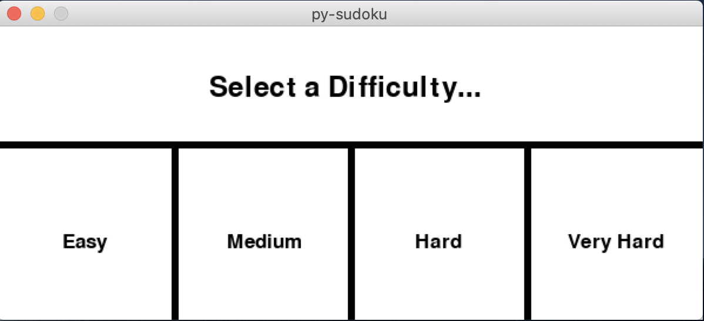
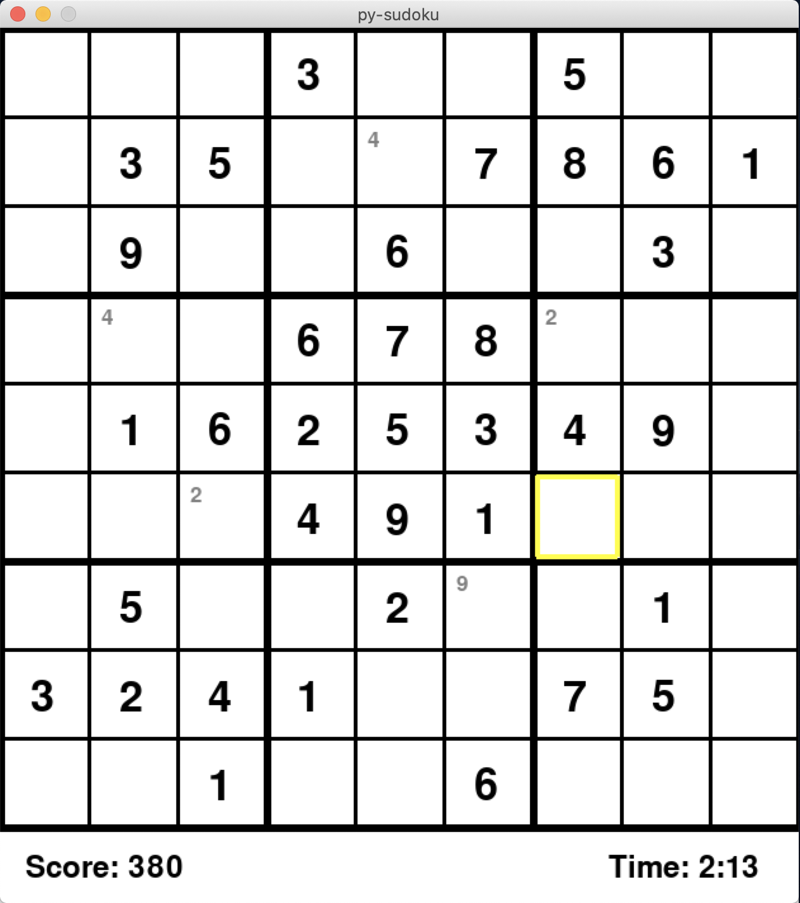

# py-sudoku

### Description
Sudoku puzzle game built in Python. Contains a solving function using a backtracking algorithm as well as a board generating algorithm at variable difficulties. GUI built using Pygame.

### Usage

##### sudoku.py
Uses a backtracking algorithm to complete a sudoku board represented by an array of integers. Can also determine if a board is not solvable (by returning false) or if a value is not valid at a certain position on the board given the values in its row, column and 3x3 box.

##### board_gen.py
Generates puzzle boards by using seed boards at four levels of difficulty (easy, medium, hard and very hard). Given seeds, the algorithm rotates, reflects and reassigns values at random to create a unique puzzle for the user. Can generate a total of 5,806,080 unique puzzles per difficulty level. 

##### GUI.py
Playable sudoku puzzle board created using Pygame. Allows the user to select a difficutly and attempt a randomized puzzle board. Supports marking each box with a digit before entering a value using the 'enter' key. Provides the user with feedback via a scoring system as well as a timer.

### Screenshots

##### Difficulty Selection

 

##### Game Board

 
